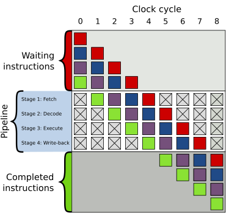
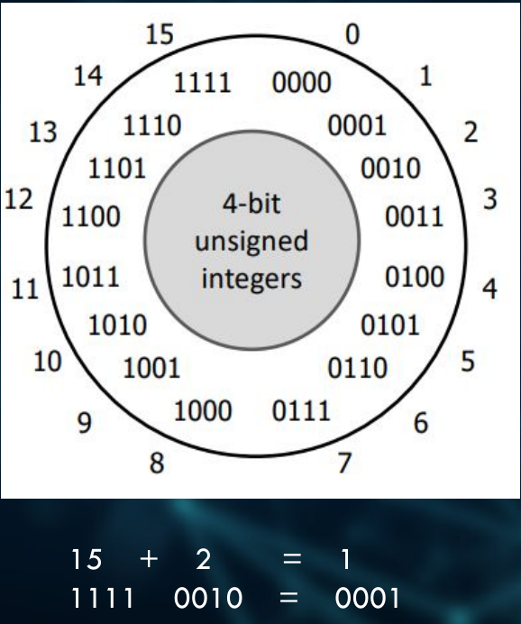

Докладчик пытается разобраться в необходимости и эффективности
использования беззнаковых целых чисел.

> В докладе обсуждаются только `x86` системы! Примеры скомпилированы
  на `clang12`.

---

## Начнем

Есть две версии реализации функций:
```cpp
#include <stdint.h>
int64_t add_and_devide_s (int64_t a, int64_t b)
{
  return (a+b)/2;
}

uint64_t add_and_devide_u (uint64_t a, uint64_t b)
{
  return (a+b)/2;
}
```
Асемблерный код, генерируемый для функций:
```cpp
add_and_devide_s (long, long):
  lae rcx, [rdi + rsi]
  mov rax, rcx
  shr rax, 63 // shift 63 bits right and extract most significat bit
  add rax, rcx
  sar rax
  ret

add_and_devide_u (unsigned long, unsigned long):
  lea  rax, [rdi + rsi]
  shr  rax
  ret
```
- Компилятор видит, что мы хотим разделить число на 2 и оптимизирует это
  деление, исходя из того, что деление на 2 равносильно сдвигу на один
  бит вправо `n >> 1`.

- Каждая инструкция, извлекаемая из памяти, пушится в
  пайплайн/конвеер(??), где может быть исполнена. Некоторые
  инструкции делятся на несколько исполнений, каждое из которых должно
  быть отправлено на конвеер.

- Каждое исполнение происходит в CPU unit, и этих юнитов конечное
  число. Поэтому иногда происходит так, что приходится ожидать, когда
  очередной юнит освободится.

- Каждое исполнение имеет задержку.
  - Задержка это число циклов, которое необходимо процессору для
    выполнения текущей инструкции.
  - Ошибки, misalignments, промахи кеша увеличивают задержку.
  - NAN's и INFS не влияют на задержку.

> ADD  - 1 цикл (не пайплайнится)\
> IMUL - 3 цикла\
> DIV  - как минимум в 20 раз медленнее чем `IMUL`

Как выглядит 4 этапный пайплайн (очень простой, современные намного
агрессивнее).



## Signed vs Unsigned

- Unsigned integer
  - range \[0, 2^n\], n - bits
  - ясно как работает переполнение, оно определено однозначно
- Signed integer
  - есть разные подходы к хранению знаковых целых чисел
    - sing and magnitude (устарело) \[-(2^(n-1)-1), +2^(n-1)-1\]
    - one's complement (устарело) \[-(2^(n-1)-1), +2^(n-1)-1\]
    - two's complement (стандарт) \[-2^(n-1), +2^(n-1)-1\]
  - начиная с C++20 разрешена только two's complement реализация
  - переполнение вызывает UB



Какой результат будет при вызове `add_uint8(255u, 1u)`?
```cpp
auto add_uint8 (uint8_t a, uint8_t b)
{
  return a + b;
}
```
Поскольку мы используем `auto`, то компилятор все типы меньшие `int`
прикастует к `int`. Следовательно возвращаемый тип будет `int`. А
операнды прикастуются к `int` по правилам _type promotions_. Т.е. это
развернется в нечто следующее:
```cpp
int add_uint8 (uint8_t a, uint8_t b)
{
  return static_cast<int>(a) + static_cast<int>(b); // -> 256
}
```

А что будет в этом случае?
```cpp
uint8_t add_uint8 (uint8_t a, uint8_t b)
{
  return a + b;
}
```
Компилятор выполнит сужающее преобразование.\
(??) А зачем компилятор вообще здесь кастует к инту каждое слагаемое?
```cpp
uint8_t add_uint8 (uint8_t a, uint8_t b)
{
  return static_cast<unsigned char>(
      static_cast<int>(a) + static_cast<int>(b)
  ); // -> 0
}
```

**Пример.**
```cpp
auto my_add (auto x, auto y)
{
  return x+y;
}
```
Что будет при вызове `my_add(uint64_t(1), int64_t(-2))`?
```cpp
unsigned long my_add (unsigned long a, long b)
{
  return a + static_cast<unsigned long>(b); // -> 18446744... != -1
}
```
- По правилам _type promotions_ тип `int64_t` прикастуется к `uint64_t`.
- Возвращаемый тип выведется из возвращаемого значения, т.е. будет
  `uint64_t`.

**Пример: бесконечный цикл.**
```cpp
uint64_t count (uint64_t size)
{
  uint64_t count;
  for (int i = 0; size-i >= 0; i++) {
    count++;
  }

  return count;
}
```
Тип переменной `i` по правилам _type promotions_ прикастуется к
`uint64_t` в выражении `size-i`. Тогда само выражение `size-i` будет
иметь тип `uint64_t`, а значения этого типа всегда неотрицательные.

**Пример.**
```cpp
void decode (std::byte* bytes, int size)
{
  if (size == 0) return;

  std::byte decoded[255];
  for (uint64_t i = 0; i < size; i++)
    decoded[i] =
      static_cast<std::byte>(static_cast<uint8_t>(bytes[i])^0xc);
}
```
- Во-первых, условие `if (size == 0)` не отлавливает отрицательные
  инты.
- Во-вторых, при проверке `i < size` тип переменной `size` будет
  прикастован к `uint64_t` по правилам _type promotions_.
- В-третьих, если переменная `size` отрицательна, то при касте будет
  какое-то огромное число 2^n-size+1.

**Пример из реального мира.**
```cpp
void do_something (std::byte* bytes, uint32_t size)
{
  for (auto i = 0; i < size; i++) {
    // ...
  }
}
```
- Какой тип будет иметь переменная `i`?
- Тип переменной `i` выведется из значения целочесленного литерала
  `0`, этот литерал имеет тип `int`.
- И если переменная `i` имеет тип `int`, то снова будут неявные
  преобразования к `uint32_t` при сравнении `i < size`.

Есть разные целочисленные литералы, нужно использовать каждый в своем
месте.
```cpp
auto a1 = 0;    // -> int
auto a2 = 0u;   // -> unsigned int
auto a3 = 0l;   // -> long
auto a4 = 0ul;  // -> unsigned long
auto a5 = 0ll;  // -> long long
auto a6 = 0ull; // -> unsigned long long
```

## `size_t` and `ssize_t`

- `size_t`
  - беззнаковый тип;
  - используется для переменных, которые обозначают размеры;
  - определен в `cstddef`;
  - ограничен константой `SIZE_MAX`
  - появился в C89 для устранения проблем переносимости кода
    (portability). Тип `unsigned int` где-то мог быть слишком мал,
    чтобы представить все адреса памяти, а тип `unsigned long` был для
    этого слишком большим.
- `ssize_t`
  - знаковый тип;
  - не один из фундаментальных типов, введен в стандарте _posix.1-2017_;
  - множество значений (мин. требования): [-1, SSIZE_MAX]. Т.е. тип
    может представить значие `-1`;
  - `for (int i = 0; i < container.ssize()-1; ++i)`.
- Новые литералы в C++23 для типа `size_t`
  ```cpp
  auto a7 = 0z;  // long
  auto a8 = 0uz; // unsigned long
  ```

**Пример.**
```cpp
uint64_t do_it (uint64_t cout)
{
  return 1 << (count % 64);
}
```
- Что в этом примере не так?
- Дело в том, что тип литерала `1` это `int`. `int` представляется 32
  битами. Может произойти _overshifting_, что приведет к UB.

## Сумма арифметической прогрессии

У нас есть две функции для вычисления суммы арифметической прогрессии:
```cpp
uint64_t arc_unsigned (uint64_t n)
{
  uint64_t sum = 0;
  for (uint64_t i = 1; i <= n; i++)
    sum += i;

  return sum;
}

int64_t arc_signed (int64_t n)
{
  int64_t sum = 0;
  for (int64_t i = 1; i <= n; i++)
    sum += i;

  return sum;
}
```
**Знаковая версия оказалась в 40 раз быстрее беззнаковой!**
В ней компилятор смог оптимизировать цикл до (a1+an)*n/2.
Я не понял, почему так происходит. Там что-то связано с UB в знаковой
версии.

## Performance vs. Well Defined Program

- Добавить флаги `-Wall`, `-Wextra`, `-pedantic`, `-Werror`.
  **Предупреждения = ошибки.**
- Использовать более новые компиляторы, потому что в них меньше багов
  и они лучше оптимизируют. Если скомпилировать последний пример с
  суммой арифметической прогрессии с помощью `clang17`, а не
  `clang12`, то обе реализации будут иметь одинаково высокую
  производительность.
- Использовать флаги `-fsanitize=signed-integer-overflow` и
  `-fsanitize=unsigned-integer-overflow`.
- Использовать новые типы для улучшения производительности:
  - `int_fastN_t` и `uint_fastN_t`
  - эти типы автоматически выбирают размеры для переменных для
    наилучшей производительности.
- Know your CPU. Нужно понимать систему, на которой будет работать
  код.
- В C++11 появились новые хелперы:
  - `MAKE_SIGNED` и `MAKE_UNSIGNED`. Они берут запрашиваемый тип
    и возвращают тип, который лучше всего подходит знаковый или
    беззнаковый (??).
  ```cpp
  auto make_signed_ver (auto val)
  {
    return std::make_signed_t<decltype(val)>(val);
  }

  constexpr auto val_signed = make_signed_ver(unt64_t(10));
  static_assert(std::same_as<const int64_t, decltype(val_signed)>);
  static_assert(val_signed == int64_t(10));
  ```
- C++20 безопасное сравнение для разных типов. Они гарантируют, что не
  произойдет ничего неожиданного.
  - `std::cmp_equal`
  - `std::cmp_not_equal`
  - `std::cmp_less`
  - `std::cmp_less_equal`
  - `std::cmp_greater`
  - `std::cmp_greater_equal`
  ```cpp
  int64_t func (auto x, auto y)
  {
    if (x < y) return y;
    return x;
  }
  ```
  При вызове `func(-10, 20ul)` значение `-10` кастанется к 
  `unsigned long` и это сломает сравнение.\
  Безопасный вариант.
  ```cpp
  int64_t func (auto x, auto y)
  {
    if (std::cmp_less(x, y)) return y;
    return x;
  }
  ```
  При вызове `func(-10, 20ul)` вернется значение `20ul`. Функция
  отработает корректно.\
  **НО!** Что если пользователь запустит функцию на
  значения, где нет правильного ответа. Нам нужно решать, как
  правильно отрабатывать в этих ситуациях.
- Не используйте `auto`, где вы в этом не уверены.
- Используйте конкретные типы везде, где только можете.
- Используйте foreach, range, range based loops вместо обычных
  индексных.
- Используйте сильные типы, где только можете.
  ```cpp
  using strong_int = int; // BAD!
  struct strong_int {     // GOOD!
    explicit strong_int (int i) : i_{i}
  private:
    int i_;
  }
  ```
